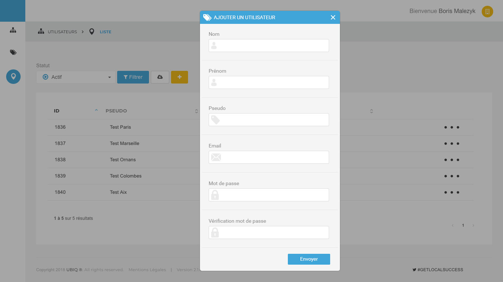

<h2>Test Webdesigner Infographiste UBIQ</h2>

<h3>Sommaire :</h3>
<ul>
    <li>Général</li>
    <li>Menu de gauche</li>
    <li>Menu en haut</li>
    <li>Le tri du tableau</li>
    <li>L'icone de statut dans le tableau</li>
    <li>Ce que je n'ai pas eu le temps de faire. Et comment je l'aurais fais</li>
    <li>La maquette du formulaire</li>
</ul>

<h4>Général</h4>

Toutes les icones sont des icons fontAwesome. La font utilisé est Roboto. Le framework utilisé est Bootstrap.

<h4>Menu de gauche</h4>

Le menu est en position [absolute]. Je joue sur la position [left] pour le déplacement du menu avec un change de valeur via JS et une animation en CSS pour le déplacement lisse. Les fonctions portent le nom de <bold>openSidebar();</bold> et <bold>closeSidebar();</bold>

<h4>Menu en haut</h4>

Le menu du haut est en deux partie. Un a contenant le nom de l'utilisateur et l'icone. La modal en position absolute. La modale apparait au clique et disparait grace à l'ajout ou au retrait d'une class en JS. Ces class modifie les valeurs : [opacity] et [pointer-event]. La fonction porte le nom de <bold>accountBox();</bold>

<h4>Le tri du tableau</h4>

Manque de temps seul le filtre statut fonctionne avec le [select]. Selon la valeur du [select] les ligne de tableaux ayant pour class ON ou OFF sont affiché via l'ajout ou non d'une class modifiant la valeur [display] des lignes. La fonction porte le nom de <bold>changeStatut();</bold>

<h4>L'icone de statut dans le tableau</h4>

Ceci est un ajout de ma part. Le JS vérifie le [innerHtml] du [td] et le remplace en fonction. Si la valeur de base est 1 (session active) alors il remplace le 1 par l'icone bleu et si la valeur de base est 0 alors il remplace par l'icone grise. La fonction porte le nom de <bold>statutIconesReplace();</bold>

<h4>Ce que je n'ai pas eu le temps de faire. Et comment je l'aurais fais</h4>
<ul>
    <li>Le tri du tableau au clique 

    
J'aurais vérifié le [innerHtml] des [td] et aurais changer l'ordre des [tr] grâce à la class [order-]. La vérification du [innerHtml] aurait trié l'ordre des [tr] grâce au fonctions <a href="https://www.miximum.fr/blog/trier-un-tableau-de-nombres-avec-javascript/" target="
    ">Trier un tableau de nombre</a> et pour le tri par alphabet un [.sort()] suffit mais pour les accents je pensais me servir de la fonction [localeCompare()].
</li>
    
    <li>L'intégration du formulaire avec vérification 

    
J'aurais intégré une modal avec verification des valeurs entrée en JS grâce à l'event [onchange].
</li>
</ul>

<h4>La maquette du formulaire</h4>

